# Getting Started with Gloo Edge and Argo Rollouts

## Introduction
In modern software development, the ability to deploy applications swiftly and seamlessly is an important competitive advantage. This is where Argo Rollouts truly shines. By harnessing the power of Argo Rollouts, organizations can ensure a smooth and controlled transition from one version of an application to the next, minimizing downtime and reducing the risk of disruptions. This level of precision not only enhances the end-user experience but also bolsters an organization's reliability and reputation. Furthermore, Argo Rollouts empowers teams to adopt advanced deployment strategies like canary releases and blue-green deployments, allowing for safe experimentation with new features and configurations. The result? Faster innovation cycles, higher customer satisfaction, and ultimately, a stronger market position for the organization.

At Solo.io, we've integrated Argo Rollouts' traffic management capabilities with Gloo Edge's advanced routing mechanisms through a supported plugin. This integration is a testament to our dedication to empowering organizations with the tools they need to succeed in the ever-evolving landscape of Kubernetes deployments. This blog provides a comprehensive guide on how to install, use, and implement various patterns for progressive delivery using Argo Rollouts and Gloo Edge.

## Prerequisites
- K8s cluster deployed

## Install the argo-rollouts controller
Install the kubectl argo-rollouts plugin as described [here](https://argoproj.github.io/argo-rollouts/installation/##kubectl-plugin-installation)

Instructions for brew
```
brew install argoproj/tap/kubectl-argo-rollouts
```

Create argo-rollouts namespace
```
kubectl create namespace argo-rollouts
```

Save the following as `kustomization.yaml`
```
cat > kustomization.yaml << EOF
apiVersion: kustomize.config.k8s.io/v1beta1
kind: Kustomization
namespace: argo-rollouts
resources:
- https://raw.githubusercontent.com/argoproj/argo-rollouts/v1.5.1/manifests/install.yaml
patchesJson6902:
  - target:
      kind: ClusterRole
      name: argo-rollouts
      version: v1
    patch: |
      - op: add
        path: /rules/-
        value:
          apiGroups:
          - gateway.solo.io
          resources:
          - virtualservices
          - routetables
          verbs:
          - '*'
  - target:
      kind: ConfigMap
      name: argo-rollouts-config
      version: v1
    patch: |
      - op: add
        path: /data
        value:
          trafficRouterPlugins: |
            - name: "solo-io/glooedge"
              location: "https://github.com/argoproj-labs/rollouts-plugin-trafficrouter-glooedge/releases/download/v0.1.0-beta1/glooedge-plugin-linux-amd64"
EOF
```

Now apply the kustomize using `kubectl apply -k` to deploy the argo-rollouts controller into the `argo-rollouts` namespace
```
kubectl apply -k .
```

Check to see if your argo-rollouts controller has been deployed:
```
% kubectl get pods -n argo-rollouts
NAME                            READY   STATUS    RESTARTS   AGE
argo-rollouts-84995876f-whzv6   1/1     Running   0          92m
```

You can see in the logs of the argo-rollouts pod that the `solo-io/glooedge` plugin was loaded in the output below
```
% kubectl logs -n argo-rollouts deploy/argo-rollouts
time="2023-10-17T23:03:26Z" level=info msg="Argo Rollouts starting" version=v1.2.0+5597ae6
time="2023-10-17T23:03:26Z" level=info msg="Creating event broadcaster"
time="2023-10-17T23:03:26Z" level=info msg="Setting up event handlers"
time="2023-10-17T23:03:26Z" level=info msg="Setting up experiments event handlers"
time="2023-10-17T23:03:26Z" level=info msg="Setting up analysis event handlers"
time="2023-10-17T23:03:26Z" level=info msg="Downloading plugin solo-io/glooedge from: https://github.com/argoproj-labs/rollouts-plugin-trafficrouter-glooedge/releases/download/v0.1.0-beta1/glooedge-plugin-linux-amd64"
time="2023-10-17T23:03:31Z" level=info msg="Download complete, it took 4.224423168s"
time="2023-10-17T23:03:31Z" level=info msg="Leaderelection get id argo-rollouts-84995876f-hmksr_db4aeb8c-ef8e-45f3-8e3e-d4419306078e"
time="2023-10-17T23:03:31Z" level=info msg="attempting to acquire leader lease argo-rollouts/argo-rollouts-controller-lock...\n"
time="2023-10-17T23:03:31Z" level=info msg="Starting Healthz Server at 0.0.0.0:8080"
time="2023-10-17T23:03:31Z" level=info msg="Starting Metric Server at 0.0.0.0:8090"
time="2023-10-17T23:03:31Z" level=info msg="successfully acquired lease argo-rollouts/argo-rollouts-controller-lock\n"
time="2023-10-17T23:03:31Z" level=info msg="I am the new leader: argo-rollouts-84995876f-hmksr_db4aeb8c-ef8e-45f3-8e3e-d4419306078e"
time="2023-10-17T23:03:31Z" level=info msg="Starting Controllers"
time="2023-10-17T23:03:31Z" level=info msg="New leader elected: argo-rollouts-84995876f-hmksr_db4aeb8c-ef8e-45f3-8e3e-d4419306078e"
time="2023-10-17T23:03:31Z" level=info msg="invalidated cache for resource in namespace: argo-rollouts with the name: argo-rollouts-notification-secret"
time="2023-10-17T23:03:31Z" level=info msg="Waiting for controller's informer caches to sync"
time="2023-10-17T23:03:31Z" level=info msg="Started controller"
time="2023-10-17T23:03:31Z" level=info msg="Starting Service workers"
time="2023-10-17T23:03:31Z" level=info msg="Starting Experiment workers"
time="2023-10-17T23:03:31Z" level=info msg="Started Service workers"
time="2023-10-17T23:03:31Z" level=info msg="Started Experiment workers"
time="2023-10-17T23:03:31Z" level=info msg="Starting Ingress workers"
time="2023-10-17T23:03:31Z" level=info msg="Started Ingress workers"
time="2023-10-17T23:03:31Z" level=info msg="Starting analysis workers"
time="2023-10-17T23:03:31Z" level=warning msg="Controller is running."
time="2023-10-17T23:03:31Z" level=info msg="Started 30 analysis workers"
time="2023-10-17T23:03:31Z" level=info msg="Starting Rollout workers"
time="2023-10-17T23:03:31Z" level=info msg="Started rollout workers"
```

## Install Gloo Edge
Install `glooctl` with brew:
```
## with brew
brew install glooctl

## manually
export GLOO_VERSION=v1.15.14
curl -sL https://run.solo.io/gloo/install | sh
export PATH=$HOME/.gloo/bin:$PATH
```

Install Gloo Edge with `glooctl`:
```
glooctl install gateway --version 1.15.14 --create-namespace
```

Install Gloo Edge with Helm
```
helm repo add gloo https://storage.googleapis.com/solo-public-helm
helm repo update
helm upgrade --install gloo gloo/gloo --namespace gloo-system --version 1.15.14 --create-namespace
```

Check to see if Gloo Edge has been deployed
```
% kubectl get pods -n gloo-system
NAME                                READY   STATUS      RESTARTS   AGE
gateway-certgen-jzwws               0/1     Completed   0          56s
svclb-gateway-proxy-pd47g           2/2     Running     0          48s
gateway-proxy-5d78cdcb85-nvbj2      1/1     Running     0          48s
discovery-54cbf678c9-2pz6s          1/1     Running     0          48s
gloo-f445dd58b-8lszg                1/1     Running     0          48s
gloo-resource-rollout-check-c45vn   0/1     Completed   0          47s
```

You can even run `glooctl check`
```
% glooctl check
Checking deployments... OK
Checking pods... OK
Checking upstreams... OK
Checking upstream groups... OK
Checking auth configs... OK
Checking rate limit configs... OK
Checking VirtualHostOptions... OK
Checking RouteOptions... OK
Checking secrets... OK
Checking virtual services... OK
Checking gateways... OK
Checking proxies... OK
No problems detected.
Skipping Gloo Instance check -- Gloo Federation not detected
```

## Review Blue-green Rollout Strategy

A Blue Green Deployment allows users to reduce the amount of time multiple versions running at the same time. This means that in a blue/green rollout that the traffic will be shifted from blue > green as soon as the green application is ready to take on traffic if `autoPromotionEnabled: true`. Additionally, a user can set the following [Configurable Features](https://argo-rollouts.readthedocs.io/en/stable/features/bluegreen/##configurable-features) listed on the upstream docs such as `autoPromotionSeconds: 20` for example

Something to note about this strategy is that besides providing connectivity from the gateway to the application, there is no traffic shifting happening from the gateway perspective moving from blue > green. The example below uses the default Argo Rollouts blue/green strategy which controls K8s services, and not Gloo Edge routes. See [Sequence of Events](https://argo-rollouts.readthedocs.io/en/stable/features/bluegreen/#sequence-of-events) for more details on this strategy.

### Blue-green Rollout Diagram
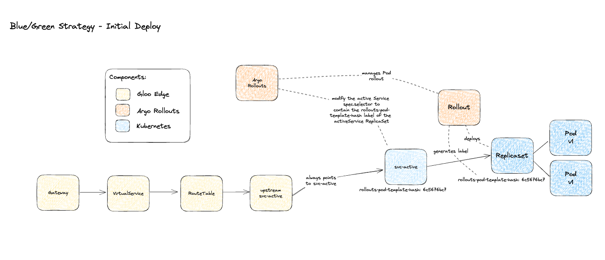

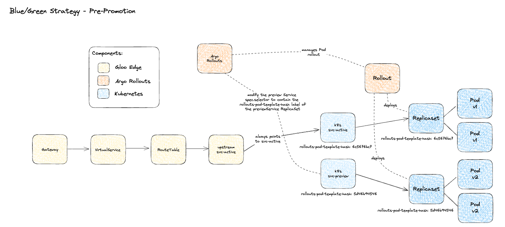

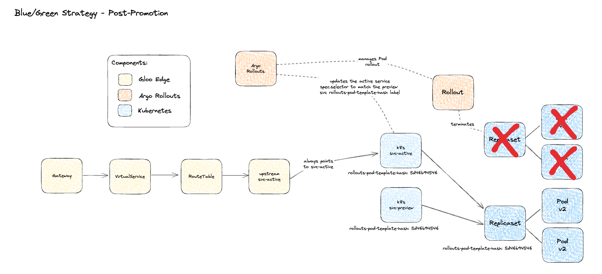


## Deploy and Configure the Initial Rollout
Deploy the rollouts-demo application. The following rollout has `autoPromotionEnabled: false` to demonstrate a manual promotion process
```
kubectl apply -f- <<EOF
apiVersion: v1
kind: Namespace
metadata:
  name: rollouts-demo
---
apiVersion: v1
kind: Service
metadata:
  name: rollouts-demo-active
  namespace: rollouts-demo
  labels:
    app: rollouts-demo
    service: rollouts-demo
spec:
  ports:
  - name: http
    port: 8080
    targetPort: 8080
  selector:
    app: rollouts-demo
---
apiVersion: v1
kind: Service
metadata:
  name: rollouts-demo-preview
  namespace: rollouts-demo
  labels:
    app: rollouts-demo
    service: rollouts-demo
spec:
  ports:
  - name: http
    port: 8080
    targetPort: 8080
  selector:
    app: rollouts-demo
---
apiVersion: v1
kind: ServiceAccount
metadata:
  name: rollouts-demo
  namespace: rollouts-demo
---
apiVersion: argoproj.io/v1alpha1
kind: Rollout
metadata:
  name: rollouts-demo
  namespace: rollouts-demo
spec:
  revisionHistoryLimit: 2
  selector:
    matchLabels:
      app: rollouts-demo
  strategy:
    blueGreen:
      activeService: rollouts-demo-active 
      previewService: rollouts-demo-preview
      autoPromotionEnabled: false
  template:
    metadata:
      labels:
        app: rollouts-demo
        version: stable
    spec:
      containers:
      - name: rollouts-demo
        image: argoproj/rollouts-demo:blue
        imagePullPolicy: IfNotPresent
        ports:
        - name: http
          containerPort: 8080
          protocol: TCP
        resources:
          requests:
            cpu: 5m
            memory: 32Mi
      serviceAccount: rollouts-demo
EOF
```

Check to see if the rollout has been deployed:
```
kubectl get rollouts -n rollouts-demo
```

Now we can expose the rollout demo UI using Gloo Edge:
```
kubectl apply -f- <<EOF
apiVersion: gloo.solo.io/v1
kind: Upstream
metadata:
  name: rollouts-demo-active
  namespace: rollouts-demo
spec:
  kube:
    selector:
      app: rollouts-demo
    serviceName: rollouts-demo-active
    serviceNamespace: rollouts-demo
    servicePort: 8080
---
apiVersion: gateway.solo.io/v1
kind: VirtualService
metadata:
  name: rollouts-demo
  namespace: gloo-system
spec:
  virtualHost:
    domains:
    - '*'
    routes:
    - matchers:
      - prefix: /
      routeAction:
        single:
          upstream:
            name: rollouts-demo-active
            namespace: rollouts-demo
EOF
```

Access our application:
```
open $(glooctl proxy url)
```

We should see the Argo Rollouts Demo with blue squares loading across the screen
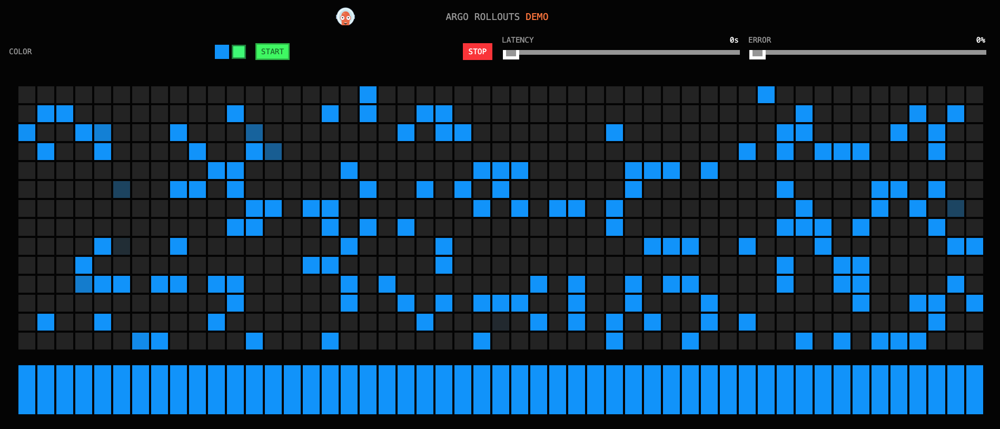

### Promoting from blue to green

Check your rollout status:
```
kubectl argo rollouts get rollout rollouts-demo -n rollouts-demo
```

Example output below:
```
% kubectl argo rollouts get rollout rollouts-demo -n rollouts-demo
Name:            rollouts-demo
Namespace:       rollouts-demo
Status:          ✔ Healthy
Strategy:        BlueGreen
Images:          argoproj/rollouts-demo:blue (stable, active)
Replicas:
  Desired:       1
  Current:       1
  Updated:       1
  Ready:         1
  Available:     1

NAME                                       KIND        STATUS     AGE  INFO
⟳ rollouts-demo                            Rollout     ✔ Healthy  22s  
└──## revision:1                                                        
   └──⧉ rollouts-demo-6ccb95ffd5           ReplicaSet  ✔ Healthy  22s  stable,active
      └──□ rollouts-demo-6ccb95ffd5-g2xtn  Pod         ✔ Running  22s  ready:1/1```
```

Now we can promote the image from the `blue` image tag to the `green` image tag
```
kubectl argo rollouts set image rollouts-demo -n rollouts-demo rollouts-demo=argoproj/rollouts-demo:green
```

Since we have set `autoPromotionEnabled: false` we can see that the rollout status is `Paused` and waiting for manual approval
```
% kubectl argo rollouts get rollout rollouts-demo -n rollouts-demo
Name:            rollouts-demo
Namespace:       rollouts-demo
Status:          ॥ Paused
Message:         BlueGreenPause
Strategy:        BlueGreen
Images:          argoproj/rollouts-demo:blue (stable, active)
                 argoproj/rollouts-demo:green (preview)
Replicas:
  Desired:       1
  Current:       2
  Updated:       1
  Ready:         1
  Available:     1

NAME                                       KIND        STATUS     AGE    INFO
⟳ rollouts-demo                            Rollout     ॥ Paused   15m    
├──## revision:4                                                          
│  └──⧉ rollouts-demo-5b8f48f456           ReplicaSet  ✔ Healthy  11m    preview
│     └──□ rollouts-demo-5b8f48f456-hsnc5  Pod         ✔ Running  36s    ready:1/1
└──## revision:3                                                          
   └──⧉ rollouts-demo-6ccb95ffd5           ReplicaSet  ✔ Healthy  15m    stable,active
      └──□ rollouts-demo-6ccb95ffd5-r9wjk  Pod         ✔ Running  9m57s  ready:1/1
```

Run the following command to promote the rollout:
```
kubectl argo rollouts promote rollouts-demo -n rollouts-demo
```

We should quickly see in the UI that traffic was shifted immediately from blue to green
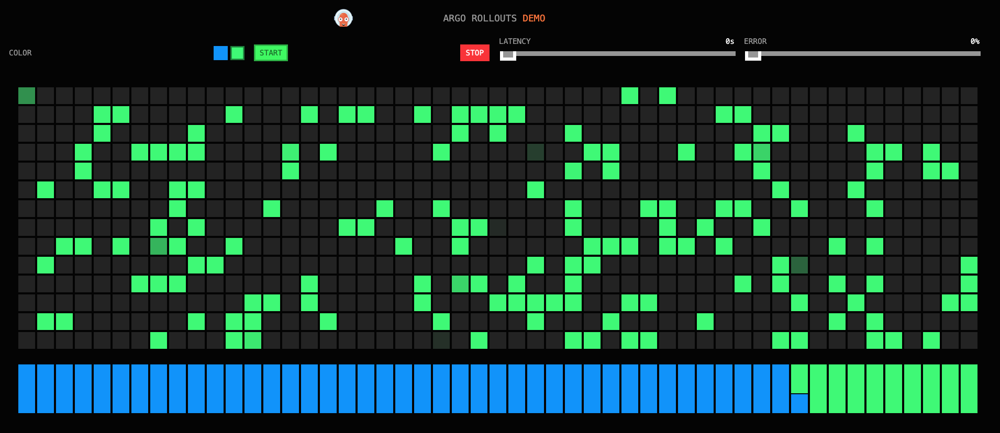

### Bonus:
If you set the Rollout strategy as follows, the promotion will happen automatically 20 seconds after the pod is marked healthy
```
strategy:
  blueGreen:
    activeService: rollouts-demo-active 
    previewService: rollouts-demo-preview
    autoPromotionEnabled: true
    autoPromotionSeconds: 20
```

### Cleanup blue/green rollouts demo
```
kubectl delete vs rollouts-demo -n gloo-system
kubectl delete upstream rollouts-demo-active -n rollouts-demo
kubectl delete rollout rollouts-demo -n rollouts-demo
kubectl delete serviceaccount rollouts-demo -n rollouts-demo
kubectl delete service rollouts-demo-preview -n rollouts-demo
kubectl delete service rollouts-demo-active -n rollouts-demo
```

## Review Canary Rollout Strategy
A Canary rollout is a deployment strategy where the operator releases a new version of their application to a small percentage of the production traffic. We can use weights, pause durations, and manual promotion in order to control how our application is rolled out across the stable and canary services

Similar to the above Blue/Green strategy, the Argo Rollouts Canary strategy supports the K8s API directly [basic example here](https://argo-rollouts.readthedocs.io/en/stable/features/canary/#example), as well as many examples of integrations for [Traffic Management](https://argo-rollouts.readthedocs.io/en/stable/features/traffic-management/) that allow more advanced rollout scenarios.

The example below uses the Canary strategy, implemented by the Gloo Edge Argo Rollouts Plugin. This plugin allows Argo Rollouts to manage Gloo Edge objects such as `Upstream`, `VirtualService`, and `RouteTable`

In the `Rollout` config, we will configure the plugin integration with Gloo Edge by defining a `trafficRouting.plugin.solo-io/glooedge`
```
trafficRouting:
  plugins:
    solo-io/glooedge:
      routeTable:
        name: rollouts-demo-routes
        namespace: rollouts-demo
```

### Canary Rollout Diagram
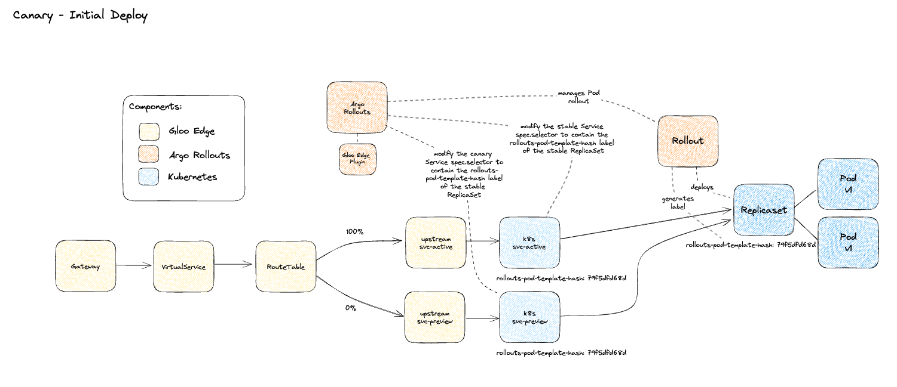

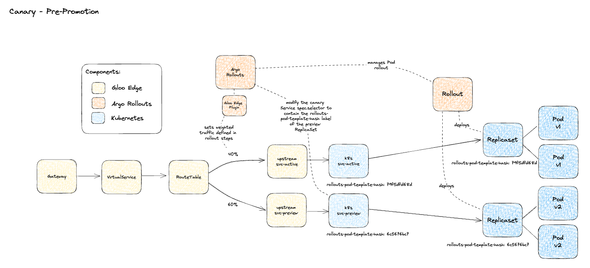

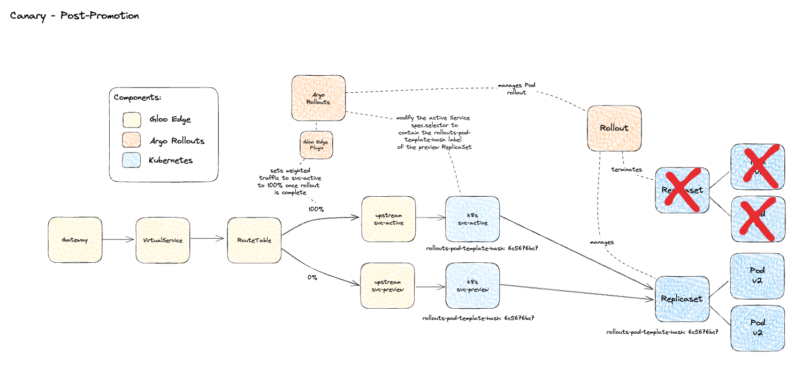

## Deploy and Configure the Initial Rollout
To get started, first we can deploy the v1 of our rollouts demo which uses the `blue` image tag
```
kubectl apply -f- <<EOF
apiVersion: v1
kind: Namespace
metadata:
  name: rollouts-demo
---
apiVersion: v1
kind: ServiceAccount
metadata:
  name: rollouts-demo
  namespace: rollouts-demo
---
apiVersion: v1
kind: Service
metadata:
  name: rollouts-demo-active
  namespace: rollouts-demo
  labels:
    app: rollouts-demo
    service: rollouts-demo
spec:
  ports:
  - name: http
    port: 8080
    targetPort: 8080
  selector:
    app: rollouts-demo
---
apiVersion: v1
kind: Service
metadata:
  name: rollouts-demo-preview
  namespace: rollouts-demo
  labels:
    app: rollouts-demo
    service: rollouts-demo
spec:
  ports:
  - name: http
    port: 8080
    targetPort: 8080
  selector:
    app: rollouts-demo
---
apiVersion: gloo.solo.io/v1
kind: Upstream
metadata:
  name: rollouts-demo-active
  namespace: rollouts-demo 
spec:
  kube:
    selector:
      app: rollouts-demo
    serviceName: rollouts-demo-active
    serviceNamespace: rollouts-demo
    servicePort: 8080
---
apiVersion: gloo.solo.io/v1
kind: Upstream
metadata:
  name: rollouts-demo-preview
  namespace: rollouts-demo
spec:
  kube:
    selector:
      app: rollouts-demo
    serviceName: rollouts-demo-preview
    serviceNamespace: rollouts-demo
    servicePort: 8080
---
apiVersion: gateway.solo.io/v1
kind: VirtualService
metadata:
  name: rollouts-demo
  namespace: gloo-system
spec:
  virtualHost:
    domains:
    - '*'
    routes:
    - matchers:
      - prefix: /
      delegateAction:
        ref:
          name: rollouts-demo-routes
          namespace: gloo-system
---
apiVersion: gateway.solo.io/v1
kind: RouteTable
metadata:
  name: rollouts-demo-routes
  namespace: gloo-system
spec:
  routes:
    - matchers:
      - prefix: /
      routeAction:
        multi:
          destinations:
          - destination:
              upstream:
                name: rollouts-demo-active
                namespace: rollouts-demo
            weight: 100
---
apiVersion: argoproj.io/v1alpha1
kind: Rollout
metadata:
  name: rollouts-demo
  namespace: rollouts-demo
spec:
  selector:
    matchLabels:
      app: rollouts-demo
  template:
    metadata:
      labels:
        app: rollouts-demo
    spec:
      containers:
      - name: rollouts-demo
        image: argoproj/rollouts-demo:blue
        imagePullPolicy: IfNotPresent
        ports:
        - name: http
          containerPort: 8080
          protocol: TCP
        resources:
          requests:
            cpu: 5m
            memory: 32Mi
      serviceAccount: rollouts-demo
  strategy:
    canary:
      stableService: rollouts-demo-active
      canaryService: rollouts-demo-preview
      trafficRouting:
        plugins:
          solo-io/glooedge:
            routeTable:
              name: rollouts-demo-routes
              namespace: gloo-system
      steps:
        - setWeight: 10
        - pause: {duration: 5}
        - setWeight: 25
        - pause: {duration: 5}
        - setWeight: 50
        - pause: {duration: 5}
        - setWeight: 75
        - pause: {duration: 5}
        - setWeight: 100
        - pause: {duration: 5}
EOF
```

Check your rollout status:
```
kubectl argo rollouts get rollout rollouts-demo -n rollouts-demo
```

Output should look similar to below:
```
% kubectl argo rollouts get rollout rollouts-demo -n rollouts-demo
Name:            rollouts-demo
Namespace:       rollouts-demo
Status:          ✔ Healthy
Strategy:        Canary
  Step:          10/10
  SetWeight:     100
  ActualWeight:  100
Images:          argoproj/rollouts-demo:blue (stable)
Replicas:
  Desired:       1
  Current:       1
  Updated:       1
  Ready:         1
  Available:     1

NAME                                              KIND        STATUS     AGE  INFO
⟳ rollouts-demo                           Rollout     ✔ Healthy  86s  
└──## revision:1                                                               
   └──⧉ rollouts-demo-f7c568d5d           ReplicaSet  ✔ Healthy  86s  stable
      └──□ rollouts-demo-f7c568d5d-dv8fd  Pod         ✔ Running  86s  ready:1/1
```

### Initiating a new Rollout
Now lets promote the image from the `blue` image tag to the `green` image tag and watch the traffic pattern in the UI
```
kubectl argo rollouts set image rollouts-demo -n rollouts-demo rollouts-demo=argoproj/rollouts-demo:green
```

This time, instead of immediately switching from blue to green, we will see a more gradual shift in traffic as defined in our rollout strategy
```
steps:
- setWeight: 10
- pause: {duration: 5}
- setWeight: 25
- pause: {duration: 5}
- setWeight: 50
- pause: {duration: 5}
- setWeight: 75
- pause: {duration: 5}
- setWeight: 100
- pause: {duration: 5}
```

In the rollouts demo UI we should be able to see the steps and the respective weights pretty clearly in the shift from blue to green.
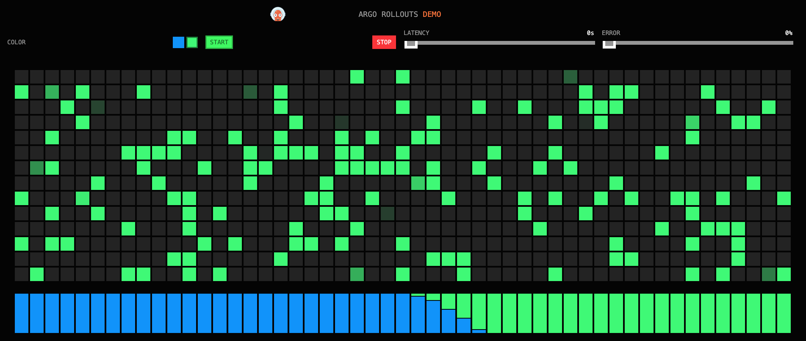

### Bonus:
If you set the Rollout strategy steps as follows, the promotion will happen automatically every 5 seconds except for the second step (at 25%) which requires a manual promotion
```
steps:
- setWeight: 10
- pause: {duration: 5}
- setWeight: 25
- pause: {}
- setWeight: 50
- pause: {duration: 5}
- setWeight: 75
- pause: {duration: 5}
- setWeight: 100
- pause: {duration: 5}
```

When doing so, you can also run a `-w` watch command on the following resources to visualize the config changes being managed by the Rollouts controller which are described in the diagrams at the top of this section
```
kubectl get svc rollouts-demo-active -n rollouts-demo -oyaml -w
kubectl get svc rollouts-demo-preview -n rollouts-demo -oyaml -w
kubectl get routetable rollouts-demo-routes -n gloo-system -oyaml -w
```

Run the following command to promote the rollout:
```
kubectl argo rollouts promote rollouts-demo -n rollouts-demo
```

In the rollouts demo UI we should be able to see that the rollout pauses at the 25% weight until promoted, with the rest of the rollout automatically promoted after a 5 second duration between steps.
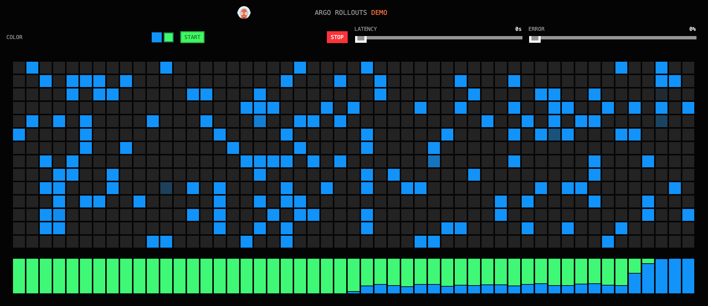

## Analysis Runs
As a part of the `Rollout`, analysis can be run in the background -- while the canary is progressing through its rollout steps.

An AnalysisTemplate is a template spec which defines how to perform a canary analysis, such as the metrics which it should perform, its frequency, and the values which are considered successful or failed. AnalysisTemplates may be parameterized with inputs values.


Here are two very simple `AnalysisTemplate` examples to mimic two behaviors `pass` and `always-fail`
```
kubectl apply -f- <<EOF
# This AnalysisTemplate will run a Kubernetes Job every 5 seconds that succeeds.
kind: AnalysisTemplate
apiVersion: argoproj.io/v1alpha1
metadata:
  name: pass
  namespace: rollouts-demo
spec:
  metrics:
  - name: pass
    count: 1
    interval: 5s
    failureLimit: 1
    provider:
      job:
        spec:
          template:
            spec:
              containers:
              - name: sleep
                image: alpine:3.8
                command: [sh, -c]
                args: [exit 0]
              restartPolicy: Never
          backoffLimit: 0
---
# This AnalysisTemplate will run a Kubernetes Job every 5 seconds, with a 50% chance of failure.
# When the number of accumulated failures exceeds failureLimit, it will cause the analysis run to
# fail, and subsequently cause the rollout or experiment to abort.
kind: AnalysisTemplate
apiVersion: argoproj.io/v1alpha1
metadata:
  name: always-fail
  namespace: rollouts-demo
spec:
  metrics:
  - name: always-fail
    count: 2
    interval: 5s
    failureLimit: 1
    provider:
      job:
        spec:
          template:
            spec:
              containers:
              - name: sleep
                image: alpine:3.8
                command: [exit 0]
                args: [exit 0]
              restartPolicy: Never
          backoffLimit: 0
EOF
```

Now we can add an `strategy.canary.steps.analysis` config to our `Rollout`
```
kubectl apply -f- <<EOF
apiVersion: argoproj.io/v1alpha1
kind: Rollout
metadata:
  name: rollouts-demo
  namespace: rollouts-demo
spec:
  selector:
    matchLabels:
      app: rollouts-demo
  template:
    metadata:
      labels:
        app: rollouts-demo
    spec:
      containers:
      - name: rollouts-demo
        image: argoproj/rollouts-demo:blue
        imagePullPolicy: IfNotPresent
        ports:
        - name: http
          containerPort: 8080
          protocol: TCP
        resources:
          requests:
            cpu: 5m
            memory: 32Mi
      serviceAccount: rollouts-demo
  strategy:
    canary:
      canaryService: rollouts-demo-canary
      stableService: rollouts-demo-stable
      trafficRouting:
        plugins:
          solo-io/glooedge:
            routeTable:
              name: rollouts-demo-routes
              namespace: rollouts-demo
      steps:
        - setWeight: 10
        - pause: {duration: 5}
        - setWeight: 25
        - pause: {duration: 5}
        - setWeight: 50
        - pause: {duration: 5}
        - setWeight: 75
        - pause: {duration: 5}
        - setWeight: 100
        - pause: {duration: 5}
      analysis:
        templates:
        - templateName: pass
        #- templateName: always-fail
        startingStep: 1
EOF
```

Now let's repeat the experiment and change the image again to another color such as back to blue, or even yellow
```
kubectl argo rollouts set image rollouts-demo -n rollouts-demo rollouts-demo=argoproj/rollouts-demo:yellow
```

If you check the rollout status again, this time we will see the added `AnalysisRun` step shows that it was `✔ Successful` which means that during the rollout the analysis was triggered and passed
```
kubectl argo rollouts get rollout rollouts-demo -n rollouts-demo
```

### Bonus exercise: Always Fail
Try it again, but this time use the `always-fail` AnalysisTemplate to observe a rollback operation. Note that by using `startingStep: 3` that the `always-fail` analysistemplate will be run as step 3 starts begins, and then will roll back.
```
analysis:
  templates:
  - templateName: always-fail
  startingStep: 3
```

You can visualize the rollout and rollback in the UI
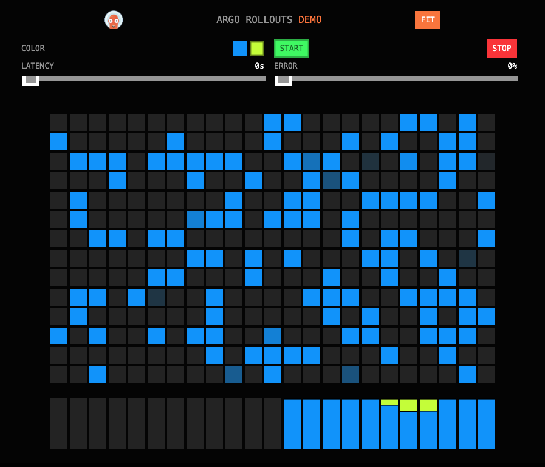

Note that it is possible to nest an `analysis` step inside of a `setWeight` step such as in the example below where analysis runs happen on steps 10% and 50%. Doing so will allow you to add additional config such as `args` to your analysis
```
steps:
- setWeight: 10
- pause: {duration: 60}
- analysis:
    templates:
    - templateName: pass
- setWeight: 25
- pause: {duration: 60}
- setWeight: 50
- pause: {duration: 60}
- analysis:
    templates:
    - templateName: pass
- setWeight: 75
- pause: {duration: 60}
- setWeight: 100
- pause: {duration: 60}
```

### Cleanup Canary rollouts demo
```
kubectl delete serviceaccount rollouts-demo -n rollouts-demo
kubectl delete service rollouts-demo-preview -n rollouts-demo
kubectl delete service rollouts-demo-active -n rollouts-demo
kubectl delete upstream rollouts-demo-active -n rollouts-demo
kubectl delete upstream rollouts-demo-preview -n rollouts-demo
kubectl delete rollout rollouts-demo -n rollouts-demo
kubectl delete analysistemplate pass -n rollouts-demo
kubectl delete analysistemplate always-fail -n rollouts-demo
kubectl delete vs rollouts-demo -n gloo-system
kubectl delete rt rollouts-demo-routes -n gloo-system
```

## Conclusion
This tutorial demonstrates the ease of integrating progressive delivery workflows to your application deployments using Argo Rollouts and Gloo Edge but only scratches the surface! Many standard options exist in the Argo Rollouts Documentation such as [BlueGreen Deployment Strategy](https://argo-rollouts.readthedocs.io/en/stable/features/bluegreen/) and [Canary Strategy](https://argo-rollouts.readthedocs.io/en/stable/features/canary/). Take a look at other strategies and routing examples in the plugin [github repo examples](https://github.com/argoproj-labs/rollouts-plugin-trafficrouter-glooedge/tree/main/examples) as well as the [Analysis & Progressive Delivery](https://argo-rollouts.readthedocs.io/en/stable/features/analysis/) documentation for more ways to get started!